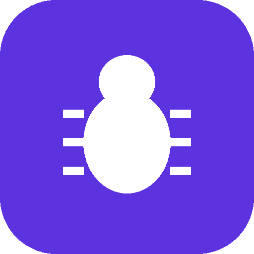

# BugTracker

A full-stack bug tracker built with Go and Next.js: create, update and comment on bug reports, with a full CI/CD pipeline (unit, API, E2E and performance tests) wired up in Jenkins.

This is a personal, from-scratch rebuild of the reference project used in the [CI/CD for Testers](https://www.udemy.com/course/cicd-testers/) Udemy course ([james-willett/bug-tracker](https://github.com/james-willett/bug-tracker)) — same stack and features, own code, own design, and an OpenAPI/Swagger layer on the API that the original didn't have.

<p align="center">
  
</p>

## Features

- Create, view, edit and delete bug reports (title, description, status, priority)
- Comment thread on each bug
- Kanban-style board (Open / In Progress / Resolved) instead of a plain table
- Interactive Swagger UI for the API
- Unit tests for both backend and frontend, plus API, E2E and performance test suites
- Dockerized, with a Jenkins pipeline that runs the whole test pyramid on every build

## Stack

| Layer        | Technology                                              |
|--------------|----------------------------------------------------------|
| Backend      | Go, gorilla/mux, bbolt (embedded DB), swaggo/Swagger      |
| Frontend     | Next.js (Pages Router), TypeScript, Tailwind CSS          |
| API tests    | Playwright (`tests-api/`)                                 |
| E2E tests    | Playwright (`tests-e2e/`)                                  |
| Perf tests   | k6 (`tests-perf/`)                                          |
| CI/CD        | Jenkins (`Jenkinsfile`, `jenkins/`)                          |
| Packaging    | Docker & Docker Compose                                     |

## Quick start (Docker Compose)

```bash
git clone <your-repo-url> bugtracker
cd bugtracker
docker compose up --build
```

- Frontend: http://localhost:3000
- Backend API: http://localhost:8080
- Swagger UI: http://localhost:8080/api/docs/index.html

## Manual setup

### Backend

```bash
cd backend
go mod download
go run ./cmd/server
```

### Frontend

```bash
cd frontend
npm install
npm run dev
```

See `backend/README.md` and `frontend/README.md` for configuration details (env vars, regenerating Swagger docs, etc).

## Running the tests

```bash
# Backend unit tests
cd backend && go test ./... -v

# Frontend unit tests
cd frontend && npm test

# API tests (backend must be running on :8080)
cd tests-api && npm install && npm run test:local

# E2E tests (frontend must be running on :3000)
cd tests-e2e && npm install && npx playwright test

# Performance tests (backend must be running on :8080)
cd tests-perf && k6 run script.js
```

## Project structure

- `backend/` — Go API (bugs + comments, bbolt storage, Swagger docs)
- `frontend/` — Next.js UI (kanban board, bug detail page, comments)
- `tests-api/` — API-level Playwright tests
- `tests-e2e/` — Browser-level Playwright tests against the real UI
- `tests-perf/` — k6 load test
- `jenkins/` — local Jenkins (Docker-in-Docker) setup
- `Jenkinsfile` — the CI/CD pipeline: build → unit tests → docker build → API tests → E2E tests → perf tests

## CI/CD with Jenkins

```bash
cd jenkins
docker compose up --build
```

Jenkins comes up at http://localhost:9000. Point a Pipeline job at this repo's `Jenkinsfile` to run the full pipeline: backend build & unit tests, frontend build & unit tests, Docker image builds, then API, E2E and performance tests against the running stack.

## License

MIT — see [LICENSE](LICENSE).
